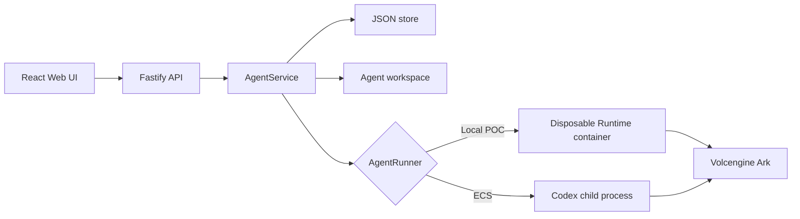
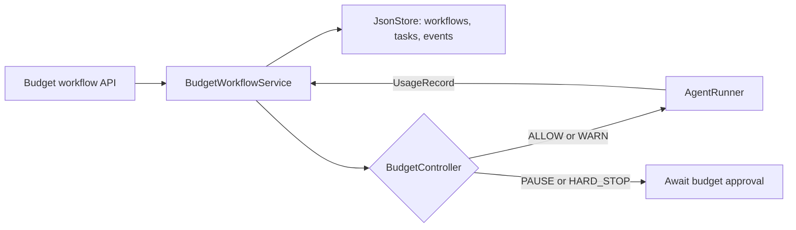

# Architecture

Volc Agent Launchpad is a single-node control plane for hackathon use.



## Components

### Web UI

Lists Agents, manages lifecycle actions, submits prompts, and polls asynchronous
Runs. It never receives the Ark API key.

### Fastify API

Validates requests, protects remote demos with a shared bearer token, and
serves the compiled Web UI. The token is not user identity or authorization.

### AgentService

Coordinates lifecycle state, persistence, workspaces, and Runs. One Agent can
have only one active Run.

```text
ready -> busy -> ready
  |       |
  v       v
stopped  error
```

Interrupted Runs become `cancelled` after a restart.

### BudgetWorkflowService

`BudgetWorkflowService` orchestrates a budgeted plan from creation through
completion. A plan may be supplied by the operator or generated by the planner;
in either case, the service validates it, persists its tasks and events, and
executes at most one task at a time on the Agent's existing Codex thread.

Before dispatching each task, the service reduces measured task usage and work
weights to a `BudgetInput` and asks the pure `BudgetController` for an admission
decision. Only `ALLOW` and `WARN` reach `AgentRunner`. `PAUSE` and `HARD_STOP`
leave the remaining tasks pending and place the workflow in
`PAUSED_BUDGET_APPROVAL`; `COMPLETE` ends the workflow. Missing token usage also
causes a pause because the remaining cost can no longer be forecast safely.



The service claims the Agent as `busy` for the execution loop. This prevents a
Playground message or a second workflow from using the same runtime and Codex
thread outside budget accounting. Repeated starts join the existing loop rather
than dispatching a task twice.

An operator may raise the budget and request a normal resume, which recomputes
the admission decision before continuing. Alternatively, force-resume may
override a predictive `PAUSE` for exactly one task. The resulting usage is then
recorded and the workflow is reevaluated normally. Force-resume cannot override
a `HARD_STOP`. Stopping a workflow blocks future admission but does not cancel a
task already in flight.

This service and `BudgetController` are trusted backend components. The browser
may request create, stop, update, or resume operations, but it never makes the
admission decision. The auditable enforcement point is the call from
`BudgetWorkflowService` to `AgentRunner`: the runner must be unreachable unless
the controller's current decision admits the next task.

### Storage

```text
data/launchpad.json       Agent, message, and Run metadata
workspaces/AgentID/       Agent-created files
workspaces/.deleted/      Archived deleted workspaces
codex-home/               Codex configuration and sessions
```

`JsonStore` serializes writes and atomically replaces one JSON file. It supports
one process only.

### Runtime providers

- `CodexRunner` runs Codex inside the application container for ECS.
- `ContainerCodexRunner` starts one disposable Docker, Colima, or Podman
  container for every local turn.

Both providers use argv-only process execution, bound output and time, resume
the stored Codex thread, and escalate termination after a grace period.

## Deployment profiles

| Profile | Control plane | Agent execution |
| --- | --- | --- |
| Local POC | Host Node.js | Disposable local container |
| ECS | Application container | Codex process in the same container |
| Local development | Host Node.js | Host Codex process |

## Extension seams

| Track | Primary seam | Expected change |
| --- | --- | --- |
| Glass Box | `AgentRunner`, `AgentRun` | Emit and display correlated execution events. |
| Bouncer | API routes, Agent ownership | Add identity and server-side authorization. |
| Kill Switch | `AgentRunner` | Add threat-specific policy or a stronger sandbox. |

The current container or ECS instance is the POC trust boundary. Ordinary
containers are not hardened multi-tenant isolation.
