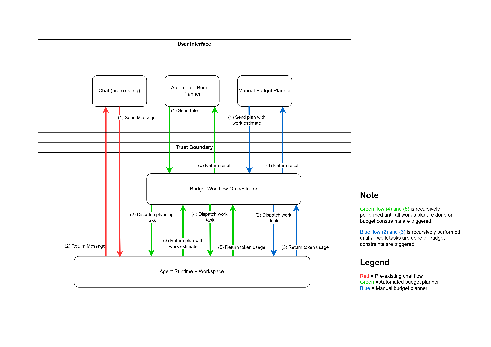

# Predictive Rate-limiting Orchastrator

**A token budget governance layer that re-forecasts an agent workflow's token cost after every task and stops for human approval before the run is projected to overspend**

---

## 1. Problem Statement

Typical agentic platforms such as Codex and Claude Code provide basic token rate-limiting solutions like Request-Per-Minute (RPM) or Token-Per-Minute (TPM), which while may be sufficient in limiting exessive usage and cost, only restrict usage after the damage has been done.

So, if an agent run is on track to consume five times its budget, typical rate-limiting system will only trigger when actual tokens are spent.

Even if agents were asked to estimate its token usage before executing its plan, these estimate would be wildly inaccurate. A study of token consumption in agentic coding tasks found that frontier models predict their own token usage only weakly (Pearson correlations up to about 0.39) and systematically underestimate the real cost ([Bai et al., 2026](https://arxiv.org/abs/2604.22750)).

Therefore, simply asking the agent to estimate its own token usage is irrepresentitive of the actual work that needs to be done.

---

## 2. Proposed Solution

Our proposed solution is a predictive rate-limiting orchastrator middleware that ingests planned tasks with work estimates (similar to a planner-orchestrator system), and re-forecasts the projected workflow's total token usage after every task. If the projected token usage is above the token budget, the workflow will pause and require user confirmation before continuing.

Unlike asking the planning agent to predict an absolute token cost, planning agents in this system are required to state, in relative terms, how much of the total effort each sub-task should represent. This allows for more flexibility and allows token usage to fluctuate above or below forcasts as long as it is within the budget.

Therefore, this system effectively projects and rate-limits agent executions based on current token usage. Ensuring that usage constraints are enforced before any real damage is done.

---

## 3. Limitations

For this hackathon the main aim was to build out the middleware that provides the token projections, dispatches agents to complete sub-tasks, and rate-limits agent execution. Therefore, several non-essential services were either ignored or simplified.

1. The Planner agent only has a single planning turn, so it does not have an interactive back-and-forth behaviour to clarify requirements.
2. The orchastrator is built to support a single-agent sequencial workflow. However, the same concept can be integrated into a multi-agent system.

---

## 3. Example Use case

An operator wants an agent to add a health endpoint to a small service. They decompose it and assign relative weights (integers, 1–10):

| #   | Task                                           | Weight | Meaning              |
| --- | ---------------------------------------------- | ------ | -------------------- |
| 1   | Inspect the workspace and summarise the layout | 1      | quick, cheap         |
| 2   | Implement the endpoint                         | 4      | the bulk of the work |
| 3   | Add a test and run it                          | 3      | substantial          |
| 4   | Print the final file and report test status    | 2      | wrap-up              |

Total weight 10. They set a token budget of 12,000, which could be their company's token usage policy.

Task 1 runs. It was supposed to be a 10th of the effort, but the workspace is larger than expected and the agent reads a lot of it: the reported usage is 4,200 tokens. The middleware now has a rate: 4,200 tokens for 1 unit of weight. Projected remaining cost is `4,200 * 9 = 37,800`; projected total is `42,000` against a budget of `12,000`.

Before task 2 is sent to the runner, `evaluateBudget` returns `PAUSE`. The workflow status becomes `PAUSED_BUDGET_APPROVAL`, a `PAUSED` event is written with the numbers that justify it, and the agent is released. The operator sees: consumed 4,200, projected total 42,000, budget 12,000, and the reason string. They can either raise the budget and resume, or force-resume without raising the budget.

Therefore without this middleware, tasks 2–4 would have run and the operator would have found out at 40,000-plus tokens that the estimate was wrong.

---

## 5. Architecture

The work on this middleware did not modify the default Starter chat behaviour, but adds ontop of the existing system.

